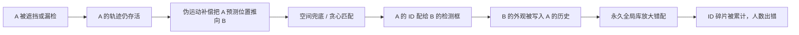
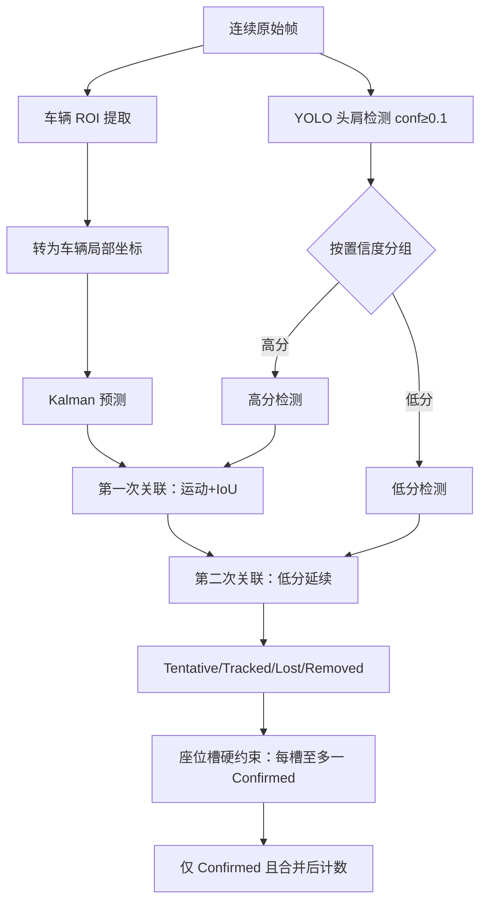

# 车辆超员场景下车内人员 ID 匹配改进方案（v2）

_对象：`target tracking/sideview_headshoulder_counter.py`、`runs/head_v2`、`prepare_head_dataset.py` · 2026-08-26（2026-08-27 更新进展）_

> 本报告是《车辆超员场景_车内人员跟踪问题分析与代码改进计划.md》的深化版。上一版的根因清单经逐行核对全部成立，本版在其基础上补充了三处此前未覆盖的**检测侧数据泄漏**、**仓库现成遮挡专用跟踪器**与**场景硬约束**内容，并把所有建议落到可直接执行的步骤。

## 📌 进展更新（2026-08-27）

> 上一版"阶段 0：修复数据泄漏"已执行完毕，本报告据此更新：

- **数据泄漏已确认并修复**：`check_data_leak.py` 全量核验 10933 个源序列，确认 19.9%（2180 个）车辆序列被切进 ≥2 个 split（同车相邻帧跨集合）。已重写 `prepare_head_dataset.py` 为序列级划分，修复后泄漏 0.0%。
- **已用新划分重训 head 模型**：`target detection/train.py`（batch=16、epochs=100、imgsz=640、从 yolov8s.pt 起步，与旧 head_v2 同口径），产物在 `target detection/run_head_seqsplit/`。
- **重训指标不降反升**：新划分下 mAP50=0.9599、mAP50-95=0.6857、recall=0.9073，均略高于旧 head_v2（0.9535/0.6793/0.9012）。说明该数据集上 head 检测本就强，泄漏对 mAP 影响小；**检测基线现已可信**。
- **新模型 vs 师兄模型检测对比已做**：`target detection/detect_vs_annotated_2model.py` 在 `20260714151020365` 序列上对比，新模型召回更全（师兄漏检的前排乘员/前挡风头部均被检出），head 检测优于师兄模型。
- **当前重心**：检测已不是瓶颈，应聚焦跟踪端改进（删伪 RANSAC、接标准 ByteTrack/FASTTracker、车辆局部坐标 + 座位槽）。

---

## 📋 摘要

当前跟踪错误的直接表现是**身份切换（ID Switch）**：某帧标注在目标 A 上的 ID，下一帧落到目标 B 上。它不是一个单一 bug，而是「检测漏检 / 低分丢弃 → 伪运动补偿把丢失轨迹推向他人 → 贪心匹配 + 空间兜底把 A 的 ID 配给 B → 外观历史被污染 → 永久全局库放大错误 → 累计计数错误」这条因果链的末端。

本报告的核心判断有四点：

1. **检测侧存在数据泄漏，是隐藏的第一根因。** `prepare_head_dataset.py` 按图像级随机划分 train/val/test，同车连续帧跨集合泄漏，导致 `mAP50=96%`、`recall=0.901` 虚高，掩盖了真实部署下的漏检。这必须先修，否则跟踪端的一切改进都无法被正确评估。
2. **当前自定义关联器应整体替换，而非继续打补丁。** 上一版已定位的伪 RANSAC、贪心匹配、无外观约束的空间兜底、永久全局 ID 认领，都是结构性问题。
3. **仓库自带遮挡专用跟踪器（FASTTracker）比手写更省事。** `ultralytics/trackers/fast_tracker.py` 已实现「遮挡时冻结/回滚卡尔曼状态 + 扩框 + 延长重激活窗口 + 抑制 ghost ID」，与本场景「遮挡导致 ID 跳变」高度对症，应作为首选基线之一，而不是从零写。
4. **本场景的三条强结构先验（固定相机、单一刚体车辆、座位离散且人数稳定）足以把问题从「通用多目标跟踪」降维到「几乎可判定」。** 车辆 ROI + 车辆局部坐标 + 座位槽硬约束，是比通用 ReID 更可靠的 ID 保持手段，应优先于 ReID。

---

## 🎯 问题精确重述

### 业务目标

固定相机在高速路口拍摄同一辆车的连续帧序列，检测车内头肩（head-shoulder），统计车内人数，判断是否超员。输入是一段**短序列**（一辆车驶过画面，通常几秒到几十秒），输出是该车的累计唯一人数。

### 关键约束（决定了方案选型）

- **在线性要求**：超员检测需在车辆驶过过程中（或尽快）给出结果，但允许序列结束后做一次保守离线修正。
- **无逐帧 ID 真值**：目前只有 `annotated_images/` 的红框标注（`detect_v2_vs_annotated.py` 已在使用，证明标注存在），尚缺 `person_id` 级别的逐帧身份标注。
- **小目标 + 红外 + 遮挡 + 高速横移**：这是多目标跟踪里最难的一档组合。

### "ID 从 A 跳到 B" 的精确发生机制



任何单一环节的修补都无法根治——因为错误会通过「外观历史污染」和「永久全局库」形成正反馈。必须同时切断「错误补偿」「错误匹配」「错误记忆」三条路径。

---

## 🧩 场景的困难与可利用先验

### 五重困难

| 困难 | 具体表现 | 对跟踪的影响 |
| --- | --- | --- |
| 小目标 | 头肩框 40–80 px，`imgsz=640` 下更小 | 定位噪声大（代码注释自述 15–20 px），运动区分力弱 |
| 频繁遮挡 | 头枕、A 柱、反光、前后座互相遮挡 | 单帧漏检、轨迹断裂 |
| 外观相似 | 红外、同车乘客发型服饰相似 | ReID 判别力差（OSNet 相似度落在 0.57–0.88 之间，阈值难切） |
| 帧间位移大 | 车高速横移，帧间位移约为目标宽度 2 倍 | 相邻帧 IoU≈0，纯 IoU 关联失效 |
| 短序列 | 每车只有几十帧 | 无法依赖长时平滑；`min_hits`、`track_buffer` 需按帧而非秒重新标定 |

### 三条强结构先验（本方案的杠杆点）

1. **固定相机、背景静止**：相机无运动，官方 BoT-SORT 的全图 GMC 应设为 `none`；运动只来自车辆这一刚体。
2. **单一刚体车辆承载全部目标**：车内所有人随车一起做近似平移，个体间相对运动很小。
3. **人数少、座位离散、序列内人数稳定**：一辆车 < 10 人，沿车身纵向座位近似一维排列，且无人中途上下车。这提供了「首末帧人数一致」的免费 sanity check。

**核心思路**：把「车辆整体运动」从「个体相对运动」中剥离出来，在**车辆局部坐标**里做关联，个体运动就退化为小扰动，ID 匹配难度大幅下降。

---

## 🐛 根因清单（分四层）

### 第 0 层：检测侧数据泄漏（本版新增，最高优先级）

| 位置 | 问题 | 后果 |
| --- | --- | --- |
| `prepare_head_dataset.py:73–81` | `random.shuffle` 图像级随机划分 train/val/test | 同车连续帧跨集合泄漏，`mAP50=96%`、`recall=0.901` 虚高 |
| 源目录 | `public0705修2`、`public0629修正`、`原图5-已审完` 是连续帧序列 | 泄漏必然发生，不是偶发 |
| `args.yaml` | `patience=30`、`imgsz=640` | 早停触发前的"最佳"epoch 仍受泄漏污染 |

> **必须验证的第一件事**：写 10 行脚本，检查 train/val/test 三个 split 中是否存在「来自同一源序列（同一日期目录）的图」。若有，则 `head_v2` 的所有指标不可信，检测召回的真实水平未知。

### 第 1 层：检测与输入修正

| 位置 | 问题 | 后果 |
| --- | --- | --- |
| `sideview_headshoulder_counter.py:35` | `CONF_THRES=0.6` | 直接丢弃被遮挡目标的低分真阳性（上一版已确认：结果帧中多次看到清晰头部无框） |
| `:60–65` | OSNet 按 RGB 预训练，但喂入 BGR crop，且无 `BGR→RGB` 转换 | 外观特征系统性失真 |
| `:353–356` | `sorted(files)` 字典序，`1,2,10` 会排成 `1,10,2` | 破坏帧序，运动模型失效 |
| `:190–198` | 速度按 `new - old` 更新，未除以 `frame_delta` | 跳帧/漏检后速度被放大 |

### 第 2 层：关联与运动补偿（上一版已定位，本版确认）

| 位置 | 问题 |
| --- | --- |
| `:109–130` | 四重循环伪 RANSAC，无一对一约束，`inliers` 可超过检测数 |
| `:138–139` | `dets` 为空时提前 return，不清理超龄轨迹、不累计位移 |
| `:181` | 贪心按分数排序，非匈牙利全局最优 |
| `:238–254` | 外观失败后仅凭 70 px 最近邻复用旧 ID，无外观约束 |
| `:225–261` | 永久 `global_id_history` 全局认领，跨任意时间抢占 |
| `:274–280` | 阶段二重激活轨迹未加入 `matched_tracks`，又被当未匹配累加 `missed_shift` |
| `:303–304` | `total_count()=len(global_id_history)`，所有新 ID 立即入库 |

### 第 3 层：生命周期与计数

| 问题 | 后果 |
| --- | --- |
| 无 `Tentative → Confirmed` 确认过程 | 单帧误检立即计入人数 |
| `MAX_AGE=8` 固定帧 | 遮挡时长是秒级量，应按时长换算 |
| 无「活跃轨迹不可被丢失轨迹抢占」约束 | A 的 Lost 轨迹可抢 B 的框 |

---

## 📚 文献方法映射（可落地）

> 完整文献清单与 ID 分裂解决方案表见 `C:\Users\TestUser\Desktop\文献调研_BoTSORT跟踪算法\文献调研报告_BoT-SORT目标跟踪.md` 附录。本表只保留与本场景强相关、且能落到代码的方法。

| 方法 | 出处 | 对应本场景的问题 | 落地方式 |
| --- | --- | --- | --- |
| **BYTE 低分框二次关联** | ByteTrack (ECCV22)、张求星论文 | `conf=0.6` 丢弃遮挡低分真阳性 | 高分框先关联，低分框（如 0.1–0.5）只延续已确认轨迹，不建新 ID |
| **卡尔曼滤波状态估计** | SORT/ByteTrack/BoT-SORT | 伪 RANSAC 补偿不可靠 | 用 `ultralytics` 自带 `KalmanFilterXYAH`，在车辆局部坐标上跑 |
| **GMC 相机运动补偿** | BoT-SORT (arXiv22)、杨磊论文 | 固定相机但车在动，需"车辆运动变换"而非"相机运动" | 用 `ultralytics/trackers/utils/gmc.py` 的 `apply_sparseoptflow`，仅在**车辆 ROI** 上估计仿射矩阵 |
| **外观 EMA 更新 (α≈0.9)** | StrongSORT (TMM23) | 5 帧取 max 易被偶然高相似污染 | 用 L2 归一化后的 EMA 原型替代 `deque(maxlen=5)` |
| **观测中心动量 OCM + 方向一致性** | OC-SORT (CVPR23)、何均洋论文 | 车横移大、个体方向稳定 | 关联代价加入「轨迹-检测连线方向」一致性 |
| **噪声尺度自适应 (NSA)** | 靳岩论文、刘文松论文 | 低置信度检测带偏卡尔曼 | 按检测置信度调整观测噪声协方差 `R` |
| **伪轨迹补偿 / 遮挡插值** | 靳岩论文、StrongSORT GSI | 短时遮挡后轨迹断裂 | 遮挡期冻结状态 + 重关联后插值 |
| **轨迹管理规范（帧末统一登记）** | DeepSORT/ByteTrack | 同帧重复 ID（历史 bug） | 新 ID 帧末统一提交（上一版已修，但新架构必须保留） |

**关键结论（来自文献）**：杨磊论文自述「OSNet 外观在高速非线性运动下仍会 ID 切换」，印证了**单靠外观网络不够，必须配合运动补偿 + 空间约束**。这正是本报告把「车辆局部坐标 + 座位槽」排在 ReID 之前的原因。

---

## 🏗️ 推荐架构

### 三档方案（从省事到彻底）

| 档 | 方案 | 工作量 | 适用判断 |
| --- | --- | ---: | --- |
| **B1（先做）** | 检测数据修复 + 高低分检测 + 直接用仓库现成 ByteTrack/FASTTracker | 0.5–1 天 | 最快拿到一个可信的、可对比的基线 |
| **B2（核心）** | B1 + 车辆 ROI + 车辆局部坐标 + 座位槽硬约束 | 2–3 天 | 本场景的根本解 |
| **B3（可选）** | B2 + 专域 ReID 或专域训练 | 3–7 天 | 仅当 B2 仍有 IDSW 且确认是外观瓶颈时 |

### 目标流水线



### 车辆局部坐标（B2 的关键）

若每帧得到车辆框 `V=(vx1,vy1,vx2,vy2)`，将头框归一化：

```text
u = (head_cx - vx1) / vehicle_width
v = (head_cy - vy1) / vehicle_height
w = head_width  / vehicle_width
h = head_height / vehicle_height
```

车横移几百像素时，同一乘员的 `(u,v,w,h)` 只小幅变化，个体运动退化为小扰动。这样可**从源头删除** `global_shift`、`global_vehicle_velocity`、`missed_shift` 和固定像素门限。

**车辆框的来源（按优先级）**：

1. 若有车辆检测模型/标注 → 直接用车辆框。
2. 若无 → 用 `GMC.apply_sparseoptflow` 在**车辆车身区域（排除车窗头框）**估计车辆仿射变换，或用帧差/背景模型框出移动车辆 ROI。
3. 最简兜底 → 取所有头框的外接矩形作为车辆近似 ROI（头框都集中在车内，外接矩形即车辆纵向范围）。

### 座位槽硬约束（比"软线索"更硬）

在车辆局部坐标下，同一乘员的纵向位置 `u` 长期稳定。把车身沿 `u` 轴分成 K 个座位槽（利用代码注释中已有的「邻座间距 ~35 px」先验），**每个槽最多允许一个 Confirmed 轨迹**。这是一条硬约束，能结构性消灭大部分 ID 切换和重复计数。

---

## 🛠️ 分阶段实施计划

### 阶段 0：修复数据泄漏 ✅（已完成 2026-08-27）

1. ~~写脚本验证 train/val/test 是否存在同源序列泄漏（见第 0 层）。~~ → `check_data_leak.py` 全量核验完成：19.9% 序列泄漏。
2. ~~**按「序列 / 车辆」重新划分**~~ → 已重写 `prepare_head_dataset.py` 为序列级划分，修复后泄漏 0.0%。
3. ~~用新的划分重训或至少重估 `head_v2` 的真实召回。~~ → 已重训 `run_head_seqsplit`（batch=16、epochs=100），mAP50=0.9599 不降反升。
4. ~~得到真实的检测 recall/AP，作为后续一切改进的基线。~~ → 检测基线已可信，问题聚焦跟踪端。

> ✅ 阶段 0 已完成。检测指标在序列级划分下重新报告：mAP50=0.9599、recall=0.9073。下一步进入阶段 1（建立可测基线）。

### 阶段 1：建立可测基线

1. 选至少 3 组问题最明显的序列，逐帧标注 `head bbox + person_id + visible/occluded`。
2. 补充两类序列：连续空检测帧、两名相邻乘员一人短暂遮挡。
3. 保存每帧原始检测（框、置信度、真实 ID），不经过跟踪器，单独测检测召回。
4. 保存跟踪日志：代价矩阵、门控淘汰原因、匹配对、轨迹状态、计数决定。

**最低评估指标**：检测 Precision/Recall/AP50/AP50-95（按遮挡/头尺寸分组）；跟踪 HOTA/DetA/AssA/IDF1/IDSW/Frag；计数每车 MAE/RMSE/Exact-match/过计数率/欠计数率。

### 阶段 2：检测与输入修正（不改模型结构）

```python
result = yolo.predict(img, conf=0.1, iou=0.6, classes=[0], imgsz=640, verbose=False)[0]
```

- **高分框** `conf≥0.5`：参与第一次关联，可创建新轨迹。
- **低分框** `0.1≤conf<0.5`：只延续未匹配的已确认轨迹，不创建新 ID。
- 排序改自然排序 / 从文件名解析帧号；日志记录真实 `frame_delta`。
- ReID 裁剪前 `cv2.cvtColor(crop, cv2.COLOR_BGR2RGB)`。

> 阈值 `0.1/0.5` 是起点，需在标注验证集扫描，不写死。红外场景低阈值误检（头枕、反光、挂件）会涨，但「低分不建新 ID」约束使其影响可控。

### 阶段 3：替换自定义关联器为仓库现成 tracker

**首选：直接用 `ultralytics` 自带 tracker，不复制第二套框架。**

1. 删除 `_estimate_global_shift()`、`global_shift`、`global_vehicle_velocity`、`missed_shift`、`SPATIAL_R`、`DIST_GATE`。
2. 复用 `ultralytics/trackers/byte_tracker.py` 的轨迹池与两阶段关联，或 `fast_tracker.py` 的遮挡专用机制。
3. 复用 `ultralytics/trackers/utils/matching.py::linear_assignment()`，禁止贪心。
4. 固定相机下 `gmc_method: none`；车辆局部坐标可用后，运动模型在局部坐标上跑。
5. `track_buffer` 按时间标定：`ceil(最大可接受遮挡秒数 × 有效FPS)`，不照搬默认 30。
6. 空检测帧仍执行 Kalman predict、Lost 转换、超龄删除，禁止提前返回。

**推荐先跑三组对照，用同一套标注指标选出最优基线**：

| tracker | 配置要点 | 为什么测它 |
| --- | --- | --- |
| `bytetrack` | `track_high_thresh=0.5`、`track_low_thresh=0.1`、`track_buffer≈有效FPS×遮挡秒` | 最标准的两阶段关联，最易调 |
| `fasttrack` | 默认即可，`occ_reappear_window` 调大 | 专为遮挡 ID 跳变设计，与本场景对症 |
| `botsort` | `gmc_method=none`、`with_reid=False` | 确认关闭 GMC/ReID 后的纯运动基线 |

**FASTTracker 值得特别关注**：它的「遮挡时回滚卡尔曼状态 + 冻结速度 + 扩框 + 延长重激活窗口 + `init_iou_suppress` 抑制 ghost ID」几乎就是本场景需求的现成实现（`ultralytics/trackers/fast_tracker.py:104–259`）。若它在标注集上 IDSW 显著低于手写版本，则 B2 只需在其输入层加车辆局部坐标即可，大幅省工。

### 阶段 4：车辆局部坐标 + 座位槽（本场景核心）

1. 在调用 tracker 前，把检测 `xyxy` 映射到车辆局部坐标（或固定虚拟画布如 `1000×1000`）。
2. 关联级联固定顺序：
   1. `Tracked + 高分检测`：运动/IoU 为主，匈牙利全局一对一。
   2. `未匹配 Tracked + 低分检测`：仅用严格局部位置/IoU/尺寸方向延续。
   3. `Lost + 剩余高分检测`：时间 + 局部位置 + 外观三重门控重激活。
   4. `剩余高分检测` → `Tentative`，满足 `min_hits` 后 `Confirmed`。
   5. 任何已分配给 Tracked 的检测不再提供给 Lost。
3. 加座位槽硬约束：每槽至多一个 Confirmed 轨迹。
4. 代价函数（在局部坐标上）：

```text
C = wm * mahalanobis + wi * (1 - IoU) + wa * cosine + ws * size_change + wd * direction_change
```

所有权重和门限在标注验证集扫描，不照搬 MOT17 阈值。

### 阶段 5：计数语义修正

左上角继续显示「本序列首帧到当前帧的累计唯一人数」，但**计数条件**改为：

- `cumulative_unique_count`：仅当轨迹首次从 `Tentative` 转为 `Confirmed` 时 +1，且经过 tracklet 合并。
- `visible_count` / `uncertain_count`：诊断用，不参与主业务累计值。
- 单帧误检不计数；短时遮挡、空帧、人员离开、重激活旧轨迹均不减少或重复增加。
- 序列结束后，允许对时间不重叠的轨迹片段做一次保守合并（同车 + 合理时间间隔 + 座位一致 + 外观相似）。

### 阶段 6：回归验证与诊断输出

每帧输出结构化 CSV/JSON（`frame, det_idx, det_conf, track_id, state, match_stage, vehicle_xywh, local_xywh, motion_cost, iou_cost, appearance_cost, accepted, reject_reason, counted`）。

**必须通过的最小回归场景**：

1. 一帧无检测：轨迹进 Lost，会 aging，超 buffer 删除。
2. A 被遮挡、B 持续可见：B 保持原 ID，A 的 Lost ID 不占 B 的框。
3. 低分 A：低分框延续 A，不建新 ID。
4. 单帧假阳性：不到 Confirmed，不增加人数。
5. 两人相邻/框重叠：匈牙利一对一，无同帧重复 ID。
6. 车辆高速横移：图像位移大，局部坐标平稳。
7. 文件名 `1,2,10` 与跳帧：按真实帧号排序、正确时间间隔。
8. **首末帧人数一致**（本场景新增的免费 sanity check）。

---

## 🧪 实验与消融矩阵

| 实验 | 数据 | 检测 | 关联 | 补偿 | 计数 |
| --- | --- | --- | --- | --- | --- |
| B0 当前基线 | 泄漏数据 | conf=0.6 | 伪 RANSAC + 贪心 + 空间兜底 | 伪全局 shift | 所有历史 ID |
| B1 数据修复 | 序列级划分 | conf=0.6 | 同 B0 | 同 B0 | 同 B0 |
| B2 检测+标准跟踪 | 序列级划分 | 高低分 | ByteTrack/FASTTracker | 无 | Confirmed 唯一 ID |
| B3 场景补偿 | 序列级划分 | 高低分 | 标准 + 级联 | 车辆局部坐标 + 座位槽 | Confirmed + 合并 |
| B4 外观消融 | 序列级划分 | 高低分 | 严格级联 | B3 | B3 + ReID |

**推荐 B2 为第一个可交付版本，B3 为本场景核心，B4 仅当 B3 仍有 IDSW 且确认是外观瓶颈时做。**

---

## ✅ 验收标准与停止条件

### 必须满足

- 标注测试集 IDSW 相比 B0 下降 ≥50%，且不以显著增加漏检换取。
- 每车计数 MAE 明显低于基线，Exact-match accuracy 提升，过计数/欠计数分别报告。
- 全部回归场景（阶段 6）通过。
- 日志中不再有「内点数大于一对一可匹配数量」或未经门控的 ID 抢占。
- 数据泄漏已修复，检测指标在序列级划分下重新报告。

### 暂不建议做

- 不立即改 YOLO 主干、注意力或损失（先修数据泄漏与阈值）。
- 不在当前关联器上继续叠加 flag、兜底半径、历史库规则。
- 不照搬 MOT17 阈值和 `track_buffer=30`。
- 不把 mAP50 当跟踪/计数正确率。
- 不在无逐帧 ID 标注时宣称解决了 ID switch。

---

## 🎯 推荐实施顺序与工作量

| 优先级 | 工作 | 工作量 | 预期收益 |
| --- | --- | ---: | --- |
| P0 | 验证并修复数据泄漏，序列级重划 | 0.5–1 天 | 获得可信检测基线 |
| P0 | 标注小型 ID 验证集 + 三指标体系 | 1–2 天 | 后续改动可量化 |
| P0 | 高低分检测 + 空帧推进 + Confirmed 计数 | 0.5–1 天 | 立即降漏检与过计数 |
| P0 | 替换为 ByteTrack/FASTTracker + 匈牙利 + 关 GMC | 1–2 天 | 消除主要 ID 抢占路径 |
| P1 | 车辆 ROI + 局部坐标 + 座位槽 | 2–3 天 | 稳定高速横移下的运动门控 |
| P1 | 参数扫描 + 消融 + 回归 | 1–2 天 | 可复现结论 |
| P2 | 专域 ReID 消融与标定 | 0.5–1 天 | 判断是否启用外观 |
| P2 | 头肩专用 ReID 训练 | 3–7 天 | 仅在外观确为瓶颈时 |

---

## 🔗 关键代码位置速查

| 文件 | 关键内容 |
| --- | --- |
| `target tracking/sideview_headshoulder_counter.py` | 当前自定义跟踪器（待替换） |
| `target tracking/runs/prepare_head_dataset.py:73–81` | 图像级随机划分（泄漏源） |
| `target tracking/detect_v2_vs_annotated/detect_vs_annotated.py` | 已有的红框对比流程（可复用为标注基础） |
| `ultralytics/trackers/byte_tracker.py` | BYTETracker（两阶段关联 + 状态池） |
| `ultralytics/trackers/fast_tracker.py` | FASTTracker（遮挡专用，重点候选） |
| `ultralytics/trackers/bot_sort.py` | BOTSORT（可关 GMC/ReID） |
| `ultralytics/trackers/utils/gmc.py:91` | GMC.apply 返回 2×3 仿射矩阵，可在车辆 ROI 上跑 |
| `ultralytics/trackers/utils/matching.py:18` | 匈牙利线性分配（复用，勿自写贪心） |
| `ultralytics/cfg/trackers/*.yaml` | 各 tracker 默认参数（直接改或用命令行覆盖） |

---

_本报告基于 2026-08-26 可见的代码、训练脚本、数据集划分逻辑、文献调研与 ultralytics 自带 tracker 接口。实施前先冻结当前结果作为 B0 基线，并先完成阶段 0 的数据泄漏验证。_
